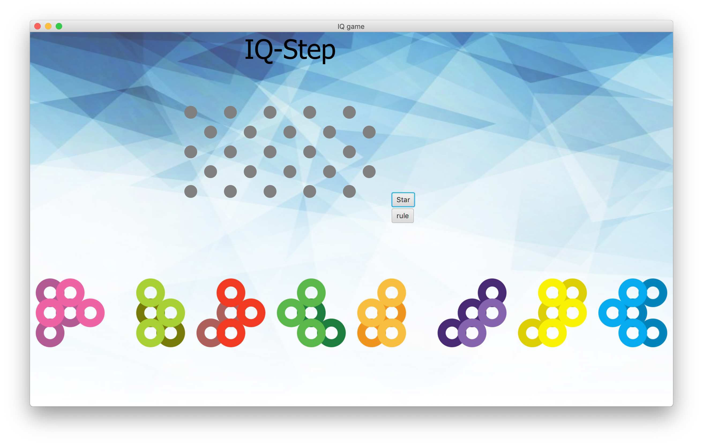

# IQ-Step
Double-layer Board Game (JavaFX GUI) - ANU@COMP1110 Assignment 2

## Sample GUI

Game Viewer                  |  Game Rule
:-------------------------:|:-------------------------:
  |  

## QuickStart
Run [game.jar](https://github.com/Chan-Xu/IQ-Step_boardGame/blob/master/game.jar)

## Instruction of this assignment
Here are more details: [Instruction](https://github.com/Chan-Xu/IQ-Step_boardGame/blob/master/Instruction.md)

## Presentation
[Slides for Presentation](https://github.com/Chan-Xu/IQ-Step_boardGame/blob/master/presentation.pdf)
